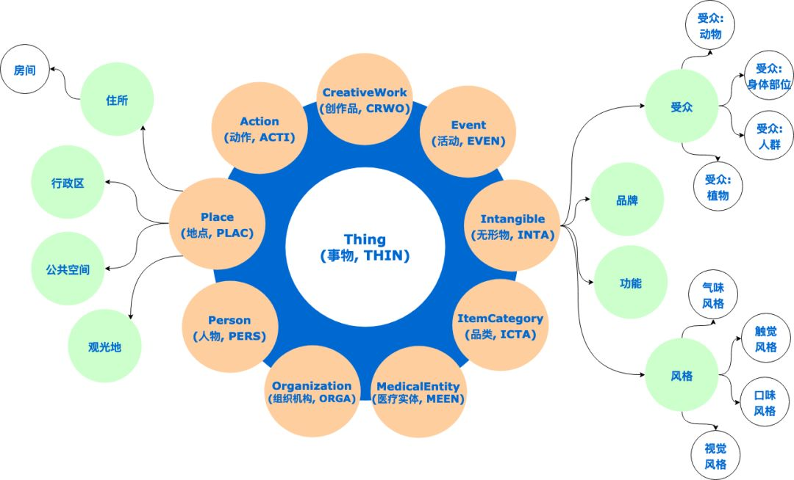

## V1 Features
### Android/iOS RuiAPP
#### 用户账号
1. 作为未注册用户，可以通过手机短信方式获取验证码登录，系统自动注册用户
1. 作为未注册用户，可以通过电子邮件方式获取验证码登录，系统自动注册用户
1. 作为未注册用户，可以通过手机短信方式通过忘记密码方式登录，系统自动注册用户
1. 作为未注册用户，可以通过电子邮件方式通过忘记密码方式登录，系统自动注册用户
1. 作为未注册用户，可以通过微信、支付宝、钉钉、Github、微博第三方账号方式登录，系统自动注册用户
1. 作为已注册用户，可以通过手机短信方式获取验证码登录
1. 作为已注册用户，可以通过电子邮件方式获取验证码登录
1. 作为已注册用户，可以通过手机短信方式通过忘记密码方式登录
1. 作为已注册用户，可以通过电子邮件方式通过忘记密码方式登录
1. 作为未注册用户，可以通过微信、支付宝、钉钉、Github、微博第三方账号方式登录
1. 作为已注册用户，可以使用用户名/手机号/电子邮件地址+密码方式登录

#### 通讯录及IM
1. 作为已登录用户，可以查看通讯录
1. 作为用户的通讯录，支持按照部门组织方式查看
1. 作为已登录用户，可以扫码加好友到通讯录
1. 作为已登录用户，可以与通讯录部门、个人进行文本聊天
1. IM信息多端保持同步

#### 应用协作
1. 作为已登录用户，可以扫描RuiOPR桌面应用的登录二维码登录RuiOPR
1. 优先调度，领导上级可以就任务优先调度如像飞机上通知一样必须优先完成，系统内有算法或人工指定优先级

#### 知识图谱
1. 爷爷奶奶姥爷姥姥可以辅导k12学生作业
1. 爷爷奶奶姥爷姥姥可以看到老师的辅导教材如ppt（翻转课堂）辅导k12学生预习
1. ppt编辑发布revealjs，参见[FLIPCLASSROOM](./FLIPCLASSROOM.md)
1. [K12「知识图谱型」AI教育「真香」？](https://www.jiqizhixin.com/articles/2019-05-25)
1. [王海峰：百度知识图谱与语义理解实践](https://www.secrss.com/articles/13652)
1. [自生长自适应，知识系统的社交网络实践](https://36kr.com/p/5213250)
1. [基于社交网络知识图谱的知识推理系统及方法](https://patentimages.storage.googleapis.com/24/75/12/3b5c615db7c910/CN107016072A.pdf)
1. [基于社交网络的知识图谱构建技术研究](http://kns.cnki.net/kcms/detail/detail.aspx?filename=1018841734.nh&dbcode=CDFD&dbname=CDFDTEMP&v=)
1. [知识图谱全讲解 + 电商应用场景](https://blog.csdn.net/randompeople/article/details/89426073)
1. [知识图谱SCHEMA：【人】单独的人类个体（可以是现实中的或者虚构的） A person (alive, dead, undead, or fictional).](http://cnschema.org/Person)
1. [How to Use Schema.org for eCommerce Websites](https://www.osiaffiliate.com/blog/how-to-use-schema-org-for-ecommerce-websites/)

### Win/Mac桌面RuiOPR
*桌面应用不提供用户注册、忘记密码等已在RuiAPP上已有的功能,以便更好推广RuiAPP，所以RuiOPR也不支持第三方如微信进行扫码登录*
1. 展示二维码以便使用RuiApp扫码登录
1. RuiOPR可以安装在Windows、Macos、Linux，可以与RuiApp在多个安装实例同时保持登录而不是像微信一样只能在windows或macos登录，但是RuiAPP上能显眼看出现在保持登录的终端列表。
1. 通过RuiApp可以下线其他客户端，当然RuiApp也可以在多个手机端同时保持登录，也可以被踢下线。根据老人子女关系可以关联成多个家庭如姥姥家、奶奶家，登录子女都可以获取家庭老人的信息如政购项目信息及享受条件。同时IM信息多端保持同步。

#### 应用协作
1. 作为未登录用户，可以使用RuiAPP扫描RuiOPR桌面应用的登录二维码登录RuiOPR https://www.jianshu.com/p/7f072ac61763

#### 通讯录及IM
1. 作为已登录用户，可以查看通讯录
1. 作为用户的通讯录，支持按照部门组织方式查看
1. 作为已登录用户，可以与通讯录部门、个人进行文本聊天

#### 任务工单
1. 作为已登录用户，可以将一条、多条聊天信息转为任务工单，以便进行跟踪管理
1. 作为已登录用户，可以浏览按时间排序的任务清单
1. 作为已登录用户，可以按照关键字搜索任务清单

### 脑洞
持久性可管理内置知识图谱即时通信：
1. slack+QA+Task+知乎 
1. 沟通过程中标记是否问题以便回答，是否任务以便分配人员跟进处理，参见- [Improving the User Experience with Uber’s Customer Obsession Ticket Routing Workflow and Orchestration Engine](https://eng.uber.com/customer-obsession-ticket-routing-workflow-and-orchestration-engine/)
1. 根据知识图谱推荐分配适合人员跟进处理任务，如根据工作时间、个人技能、老人情况、服务要求推荐分配服务人员；任务分配机制也用于进行业务派单。
1. 界面上图谱方式导航快速跳入对应消息指向的内容
1. sdk集成其他系统消息如物流信息、系统bug信息...
1. 九宫格我明天要做的事樊登读书

# 讨论技术架构

- 

## RSocket.io 连接
- [RSocket是一种新的，消息驱动的二进制协议，它标准化了云中的通信方法。它有助于以一致的方式解决常见的应用程序问题，并且它支持多种语言（例如java，js，python）和传输层（TCP，WebSocket，Aeron）](https://www.jdon.com/52741)
- [RSocket快速入门](https://yq.aliyun.com/articles/721916)
- [雷卷-RSocket Broker在阿里云上的服务-mesh，stream and iot](https://www.modb.pro/doc/1349)
- [Facebook Flipper with RSocket-cpp](https://github.com/facebook/flipper/blob/master/Specs/RSocket/0.10.0/RSocket.podspec)
- [All of the applications that communicate with each other through the Netifi broker—whether they be mobile devices, web browsers, or microservices—are “Netifi clients.”](https://docs.netifi.com/1.6.9/netifi_clients/)
- [如果RSocket-cpp不好用，Calling Java function from Qt C++](https://stackoverflow.com/questions/28655181/calling-java-function-from-qt-c)
- [如果RSocket-cpp不好用，Java Native Interface](https://docs.oracle.com/javase/6/docs/technotes/guides/jni/)
- [RSocket With Spring Boot + JS: Zero to Hero](https://dzone.com/articles/rsocket-with-spring-boot-amp-js-zero-to-hero)

## DGraph.io  数据图网
- [Running Stack Overflow on Dgraph](https://blog.dgraph.io/post/sql-vs-dgraph/)
- 
- [知识图谱 4.2-知识图谱在电商领域中的应用实践](https://juejin.im/post/5cfb1f7c6fb9a07eeb1399f6)
- [商品知识图谱的数据大图](https://zhuanlan.zhihu.com/p/33075573)
- [整理知识图谱相关学习资料](https://github.com/husthuke/awesome-knowledge-graph)
- [大众点评搜索基于知识图谱的深度学习排序实践](https://www.infoq.cn/article/JZ_qdBDiMc1pHpBMDR2Q)
- [平安养老险国内独家引进interRAI长期照护评估工具](http://www.pingan.cn/zh/common/cn_news/1479794689059.shtml)
- [interRAI家庭照护评估工具在社区居家老年人综合评估与照护需求分析中的初步应用 ](http://www.interraichina.com.cn/images/upload/file/20170123/1485158750311029.pdf)
- [基于 interRAI 评估系统的居家养老信息化体系建设可行性研究 ](http://www.interraichina.org/images/upload/file/20160425/1461552989165269.pdf)
- [【评估动态】养老服务信息化与标准化：以interRAI体系为例](http://www.ssidc.org/zhihui/f3/2017/0308/756.html)
- [【杨金宇专栏】长期照护系列之四:InterRAI的信息化](https://www.hit180.com/3742.html/2)
- [知识图谱数据构建的“硬骨头”，阿里工程师如何拿下？](https://yq.aliyun.com/articles/544941)
- [阿里，为电商而生的知识图谱，如何感应用户需求？](https://yq.aliyun.com/articles/632483)
- 
- 
- [the excellent (and long overdue) JSON-LD API best practices guide published in February 2018 is a very good example。Why we should all adopt JSON-LD](https://datalanguage.com/features/publishing-json-ld-for-developers)
- [运营商关系图谱的构建及应用：从本体论开始说起. 1993年Thomas Gruber教授提出了本体论最广为认同的定义：共享概念模型的明确的形式化规范说明。这里面实际说了四个概念，即：“概念模型”(Conceptualization)指通过客观世界中一些现象的相关概念而得到的模型；“明确”(Explicit)指所使用的概念及其约束都有明确的定义；“形式化”(Formal)指Ontology是计算机可读的；“共享(Share)”指本体论中体现的是共同认可的知识，反映的是相关领域中公认的概念集。](https://www.secrss.com/articles/9006)
- [许多大规模知识图谱都具备两个视图下的知识：以抽象概念（例如：Person、Artist）及概念间关系（例如：isA、livesIn）组成的本体视图，和以实例（例如：Barack Obama）与实例间关系（例如：has_award）组成的实例视图。](https://www.jiqizhixin.com/articles/2019-08-12-3)
    
- [本体语言OWL是RDF的扩展，提供了更广泛的定义RDFS词汇的功能，可以定义词汇间、类间、属性间关系等，从而使得数据的语义定义更加丰富，并且构成一个知识系统并支持推理。支持的功能包括：1）类运算式，如枚举，属性值约束，属性基数约束以及交集、并集、补集；2）属性公理，如RDFS属性结构，与其他属性的关系，关于属性的全局基数约束和属性的逻辑特征；3）类公理，如子类、等价类、不相交类；4）个体公理，如个体同一性。](https://juejin.im/post/5d9199bf51882573151b3e96)
- [知识图谱标准化白皮书](document/20190911095208624.pdf)
- [根据需求文档详细内容进行建模知识图谱？有意思：半自动建模方式先通过自动方式获取知识图谱，然后进行大量的人工干预过程，如图4.15所示。运用自然语言处理技术先自动建模的方法可以分为三大类1：基于结构化数据的知识建模方法，基于半结构化数据的知识建模方法和基于非结构化数据的知识建模方法。近年来，对于非结构化数据的知识建模方法研究较多，涌现出一批优秀的基于非结构化数据的知识建模方法的高水平研究成果](http://www.cesi.cn/images/editor/20190911/20190911095208624.pdf)
- [以电商为例，电商知识图谱以商品为核心，以人、货、场为主要框架。目前共涉及9大类一级本体和27大类二级本体。一级本体分别为:人、货、场、百科知识、行业竞对、品质、类目、资质和舆情。人、货、场构成了商品信息流通的闭环，其他本体主要给予商品更丰富的信息描述。](http://zhidx.com/p/141295.html)
- [How To Use Schema.org for Structured Data使用Schema.org可能会令人生畏。如果您访问该站点，则看起来非常技术性。我并不是天生就有技术背景。我必须通过日常工作来学习整个过程。如果您去那里，一开始您可能真的会感到不知所措。这似乎有点疯狂。很难使用，对吧？好吧，不一定如此。我们将逐步简化如何使用Schema.org的步骤。我们将显示一些屏幕截图，您可以在其中获取此信息，以及创建此信息的简化方法，以及一个非常非常酷的工具，我也会逐步指导您，如果您只是需要更改一些信息。](https://www.smamarketing.net/blog/schema-for-structured-data)
- [Steal Our JSON-LDThis website is a tool intended for SEO’s and webmasters seeking pre-made and validated JSON-LD markup for their websites.](https://jsonld.com/)
- [基于开放的医学知识资源，并以Schema为基础，形成疾病、药品、检验检查、手术操作等领域的概念、实体和关系，构建符合中文环境下的规范、共享、易用、动态、系统的临床诊疗相关知识图谱，为新一代医学人工智能发展提供基础设施，使得前沿人工智能技术在医疗中的应用是精准的、全面的、灵活的、可解释的、可信的。](http://kg.omaha.org.cn/)
- [一文详解知识图谱关键技术与应用 | 公开课笔记](https://cloud.tencent.com/developer/article/1348187)
- [大规模1.4亿中文知识图谱开源下载 知识图谱可视化：https://www.ownthink.com 本次ownthink开源了史上最大规模的中文知识图谱，数据是以（实体、属性、值），（实体、关系、实体）混合的形式组织，数据格式采用csv格式。](https://www.ownthink.com)
- [Share like a native app with the Web Share API](https://web.dev/web-share/)
- [Use service workers to pre-cache the App Shell - Your First Progressive Web App](https://gist.github.com/Omranic/4e648fa38caab7b8207d3e237fde0c77)
- [Mobile Deep Linking - Go-To actions can also link directly to content in native mobile apps on Android and iOS. To deep link to an app, include additional target URLs encoded with the android-app:// and ios-app:// schemes as shown below:, In-App Actions - In-App Actions are handled in-place, inside Gmail, without sending the user to any other website. In-App Actions are declared like Go-To Actions, but contain extra information that makes it easy for user-agents (such as Gmail) to handle the action inline.](https://developers.google.com/gmail/markup/actions/declaring-actions)
- [Organizations or sectors can use the NICE Framework to develop additional publications or tools that meet their needs to define or provide guidance on different aspects of workforce development, planning, training, and education.  It also assists those who support these workers, such as human resource staffing specialists and guidance counselors, to help job seekers and students understand which cybersecurity work roles and which associated Knowledge, Skills, and Abilities are being valued by employers for indemand cybersecurity jobs and positions.](https://nvlpubs.nist.gov/nistpubs/SpecialPublications/NIST.SP.800-181.pdf)
- [Open Educational Resource Schema](http://oerschema.org/)
- [Tasks State Machine : Tasks start in a Created state. Once they have been assigned to an owner they transition to the Ready state, indicating that they are ready to be performed. Once the owner initiates activity on the task, the task transitions to the In Progress state, indicating that work is being performed. Upon normal completion, the task enters the Completed state.](https://www.hl7.org/fhir/task.html)
- [An Ontology for Collaborative Tasks in Multi-agent Systems](http://ceur-ws.org/Vol-1442/paper_4.pdf)

Table 6 provides a listing of cybersecurity skills. A skill is the observable competence to perform a learned psychomotor act.

Ability is competence to perform an
observable behavior or a behavior that results in an observable product.

    如上图所示，完整的认知图谱包含以下几个部分：

    Concept：表达用户需求的最重要的语义节点。

    Ontology：一个为电商设计的知识图谱的分类体系、schema，通过与concept的连接形成最终的认知图谱，可以融合外部知识图谱数据，引入电商中很难直接挖掘到的常识。

    Relation：我们定义了十几类关系，用于描述不同节点之间的语义，是机器理解语义的关键。

    Item：基于图谱构建大规模的concept、vocabulary和relation，可以更加精确的理解商品。

    User：基于图谱构建大规模的concept、vocabulary和item attributes，可以更加精准的理解用户需求、推理用户需求。

## Cadenceworkflow.io 任务协调
- [Cadence: The Only Workflow Platform You'll Ever Need](https://www.slideshare.net/MaximFateev/cadence-the-only-workflow-platform-youll-ever-need)
- [Cadence: The Only Workflow Platform You'll Ever Need](https://www.youtube.com/watch?v=llmsBGKOuWI)
- [Improving the User Experience with Uber’s Customer Obsession Ticket Routing Workflow and Orchestration Engine。 The key difference between traditional development and the workflow paradigm is that workflows emphasize the distinction between tasks and the control logic to coordinate those tasks.中文（简体）传统开发与工作流范式之间的主要区别在于，工作流强调任务与协调这些任务的控制逻辑之间的区别。](https://eng.uber.com/customer-obsession-ticket-routing-workflow-and-orchestration-engine/)

## Bigdata Analysis 大数据分析
- [Pentaho’s data integration and analytics platform enables organizations to access, prepare, and analyze all data from any source, in any environment.](https://www.hitachivantara.com/en-us/products/data-management-analytics/pentaho-platform.html)

## IM Matrix.org
- [Clients may want to receive push notifications when events are received at the homeserver. This is managed by a distinct entity called the Push Gateway.](https://matrix.org/docs/spec/push_gateway/latest)
- [可以用WebRTC来做视频直播吗？对直播使用场景，很多人是用移动设备，移动设备基本都是用app。而webrtc中的Native Code部分跨平台特性很好，基本不用改，就能写出完全跨iOS、Android、Windows平台的代码，所以有了iOS/Android app，基本不耗成本Windows上的app就出来了。](https://www.zhihu.com/question/25497090)

## Tech basics  编程概念
- [不要再尝试函数式编程了](https://www.infoq.cn/article/b6gkx1crp2umU2*jIPQB)
- [5 分钟理解什么是“响应式编程（Reactive Programming）”](https://www.jianshu.com/p/035db36c5918)

@silencecorner @郭杰 @梁家振  
https://community.netifi.com/t/how-to-create-a-session-with-transaction-using-rsocket-rpc/120
Yes - because is connection oriented you can tie session data to the RSocket connection life cycle，所以不一定像http每次请求都要带上jwt之类的

https://www.infoq.com/presentations/rsocket-cloud-native/
The other thing this allows you to do is keep soft sticky state from the device in the actual application, so you could go ahead and keep some interesting data about the application you're working with, tied to the connection. 

知识图谱本身可以看作是一种新型的信息系统基础设施。从数据维度上讲，要求用更规范的语义提升企业数据的质量，用链接数据的思想提升企业数据之间的关联度，终极目标是将非结构、无显式关联的粗糙数据提炼为结构化、高度关联的高质量知识。每个企业都应该将知识图谱作为一种面向数据的信息系统基础设施进行持续性建设。

- 知识图谱嵌入（Knowledge Graph Embeddding）：将知识图谱中包括实体和关系的内容映射到连续向量空间的方法
- 知识抽取，养老产业方面的知识从养老政策、新闻报道、医疗健康文章中进行知识提取并存入知识图谱中
- 知识图谱包含抽象知识的本体层和描述具体事实的实力层。本体层用于描述特定领域中的抽象概念、属性、公理；实例层描述具体的实体对象、实体间的关系，包含大量的事实和数据。

## RuiOPR Tech stack
- [赚更多的钱！The bottom line: native apps make more money.](https://hatchapps.com/blog/8-differences-between-progressive-web-apps-and-native-apps/)
- [How to Create Qt Plugins](https://doc.qt.io/qt-5/plugins-howto.html)
- [This topic explains how to deploy plugin libraries for Qt or your application to load at runtime. If you use static plugins, then the plugin code is already part of your application executable and no separate deployment steps are required.](https://doc.qt.io/qt-5/deployment-plugins.html)
- [Accessing Middleware from Qt, QML or HTML5](document/basyskom_qtdevdays_middleware_121113_final.pdf)
- [Qt 5.4 正式版发布，支持 HTML5 混合开发](https://www.infoq.cn/article/2014/12/qt-5.4-release-html)

- [桌面端的 Slack快速启动与离线支持Service Workers at Slack: Our Quest for Faster Boot Times and Offline Support](https://slack.engineering/service-workers-at-slack-our-quest-for-faster-boot-times-and-offline-support-3492cf79c88)
- [【译】重建桌面端的 Slack 而不是重写](https://juejin.im/post/5d624db86fb9a06b2650a262)
- [service worker：它是一个运行在浏览器后台的javascript程序，可以操控浏览器端的存储、网络请求、消息推送等](https://zhuanlan.zhihu.com/p/42121941)
- [认识 Service Worker，毫无征兆的刷新页面的确不可接受，让我们来看看百度的lavas框架是怎么做的](https://juejin.im/post/5c6f975ef265da2d8d69dd21)
- [LAVAS 基于 Vue.js 的 PWA 解决方案 帮助开发者快速搭建 PWA 应用，解决接入 PWA 的各种问题](https://lavas.baidu.com/)
- [Here’s a screenshot of whatwebcando.today (itself a PWA, try it!) from my Chrome 52 stable on Android](https://medium.com/dev-channel/why-progressive-web-apps-vs-native-is-the-wrong-question-to-ask-fb8555addcbb)
- [最初钉钉把主要功能都在网页版上面实现.早期的客户端都是基于网页版制作的.客户端使用nw.js把网页封装成为客户端. 后来V2.X版本核心还是nw.js但是把网页版变成了离线版(把网页版的js和css保存在本地). 后来V3.X版本开始,开发了一套rvwindow实现了本地化的GUI窗口,但核心逻辑还是js和css. 再到V4.X又重新开发了一套新的GUI,重构了整个程序框架,已经看不到网页版的影子了.](https://www.twblogs.net/a/5d7e3c2ebd9eee5327ffc8bc/zh-cn)

