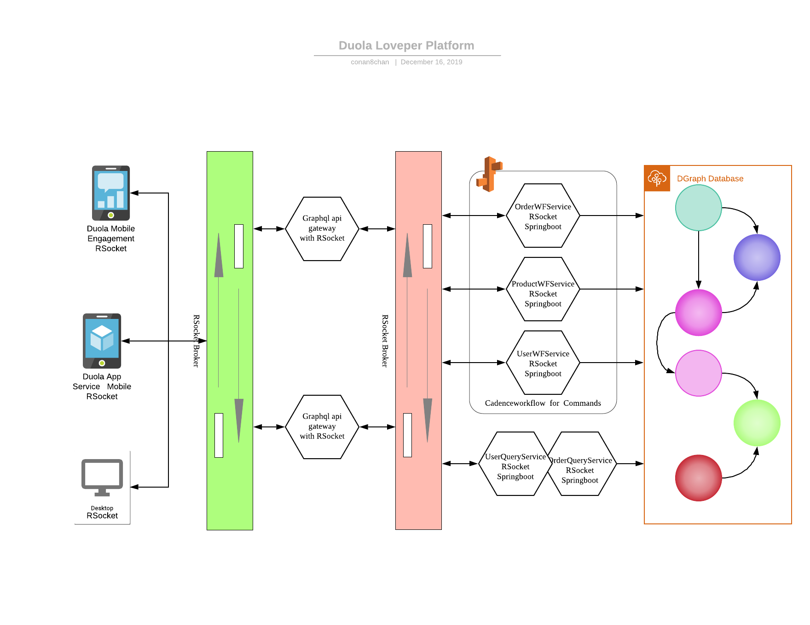

## V1 Features
### Android/iOS RuiAPP
#### 用户账号
1. 作为未注册用户，可以通过手机短信方式获取验证码登录，系统自动注册用户
1. 作为未注册用户，可以通过电子邮件方式获取验证码登录，系统自动注册用户
1. 作为未注册用户，可以通过手机短信方式通过忘记密码方式登录，系统自动注册用户
1. 作为未注册用户，可以通过电子邮件方式通过忘记密码方式登录，系统自动注册用户
1. 作为未注册用户，可以通过微信、支付宝、钉钉、Github、微博第三方账号方式登录，系统自动注册用户
1. 作为已注册用户，可以通过手机短信方式获取验证码登录
1. 作为已注册用户，可以通过电子邮件方式获取验证码登录
1. 作为已注册用户，可以通过手机短信方式通过忘记密码方式登录
1. 作为已注册用户，可以通过电子邮件方式通过忘记密码方式登录
1. 作为未注册用户，可以通过微信、支付宝、钉钉、Github、微博第三方账号方式登录
1. 作为已注册用户，可以使用用户名/手机号/电子邮件地址+密码方式登录

#### 通讯录及IM
1. 作为已登录用户，可以查看通讯录
1. 作为用户的通讯录，支持按照部门组织方式查看
1. 作为已登录用户，可以扫码加好友到通讯录
1. 作为已登录用户，可以与通讯录部门、个人进行文本聊天
1. IM信息多端保持同步

#### 应用协作
1. 作为已登录用户，可以扫描RuiOPR桌面应用的登录二维码登录RuiOPR
1. 优先调度，领导上级可以就任务优先调度如像飞机上通知一样必须优先完成，系统内有算法或人工指定优先级

#### 知识图谱
1. 爷爷奶奶姥爷姥姥可以辅导k12学生作业
1. 爷爷奶奶姥爷姥姥可以看到老师的辅导教材如ppt（翻转课堂）辅导k12学生预习
1. ppt编辑发布revealjs，参见[FLIPCLASSROOM](./FLIPCLASSROOM.md)
1. [K12「知识图谱型」AI教育「真香」？](https://www.jiqizhixin.com/articles/2019-05-25)
1. [王海峰：百度知识图谱与语义理解实践](https://www.secrss.com/articles/13652)
1. [自生长自适应，知识系统的社交网络实践](https://36kr.com/p/5213250)
1. [基于社交网络知识图谱的知识推理系统及方法](https://patentimages.storage.googleapis.com/24/75/12/3b5c615db7c910/CN107016072A.pdf)
1. [基于社交网络的知识图谱构建技术研究](http://kns.cnki.net/kcms/detail/detail.aspx?filename=1018841734.nh&dbcode=CDFD&dbname=CDFDTEMP&v=)
1. [知识图谱全讲解 + 电商应用场景](https://blog.csdn.net/randompeople/article/details/89426073)

### Win/Mac桌面RuiOPR
*桌面应用不提供用户注册、忘记密码等已在RuiAPP上已有的功能,以便更好推广RuiAPP，所以RuiOPR也不支持第三方如微信进行扫码登录*
1. 展示二维码以便使用RuiApp扫码登录
1. RuiOPR可以安装在Windows、Macos、Linux，可以与RuiApp在多个安装实例同时保持登录而不是像微信一样只能在windows或macos登录，但是RuiAPP上能显眼看出现在保持登录的终端列表。
1. 通过RuiApp可以下线其他客户端，当然RuiApp也可以在多个手机端同时保持登录，也可以被踢下线。根据老人子女关系可以关联成多个家庭如姥姥家、奶奶家，登录子女都可以获取家庭老人的信息如政购项目信息及享受条件。同时IM信息多端保持同步。

#### 应用协作
1. 作为未登录用户，可以使用RuiAPP扫描RuiOPR桌面应用的登录二维码登录RuiOPR https://www.jianshu.com/p/7f072ac61763

#### 通讯录及IM
1. 作为已登录用户，可以查看通讯录
1. 作为用户的通讯录，支持按照部门组织方式查看
1. 作为已登录用户，可以与通讯录部门、个人进行文本聊天

#### 任务工单
1. 作为已登录用户，可以将一条、多条聊天信息转为任务工单，以便进行跟踪管理
1. 作为已登录用户，可以浏览按时间排序的任务清单
1. 作为已登录用户，可以按照关键字搜索任务清单

# 讨论技术架构

- 

## RSocket.io 连接
- [RSocket是一种新的，消息驱动的二进制协议，它标准化了云中的通信方法。它有助于以一致的方式解决常见的应用程序问题，并且它支持多种语言（例如java，js，python）和传输层（TCP，WebSocket，Aeron）](https://www.jdon.com/52741)
- [RSocket快速入门](https://yq.aliyun.com/articles/721916)
- [雷卷-RSocket Broker在阿里云上的服务-mesh，stream and iot](https://www.modb.pro/doc/1349)
- [Facebook Flipper with RSocket-cpp](https://github.com/facebook/flipper/blob/master/Specs/RSocket/0.10.0/RSocket.podspec)
- [All of the applications that communicate with each other through the Netifi broker—whether they be mobile devices, web browsers, or microservices—are “Netifi clients.”](https://docs.netifi.com/1.6.9/netifi_clients/)
- [如果RSocket-cpp不好用，Calling Java function from Qt C++](https://stackoverflow.com/questions/28655181/calling-java-function-from-qt-c)
- [如果RSocket-cpp不好用，Java Native Interface](https://docs.oracle.com/javase/6/docs/technotes/guides/jni/)
- [RSocket With Spring Boot + JS: Zero to Hero](https://dzone.com/articles/rsocket-with-spring-boot-amp-js-zero-to-hero)

## DGraph.io  数据图网
- [Running Stack Overflow on Dgraph](https://blog.dgraph.io/post/sql-vs-dgraph/)
- 
- [知识图谱 4.2-知识图谱在电商领域中的应用实践](https://juejin.im/post/5cfb1f7c6fb9a07eeb1399f6)
- [商品知识图谱的数据大图](https://zhuanlan.zhihu.com/p/33075573)
- [整理知识图谱相关学习资料](https://github.com/husthuke/awesome-knowledge-graph)
- [大众点评搜索基于知识图谱的深度学习排序实践](https://www.infoq.cn/article/JZ_qdBDiMc1pHpBMDR2Q)
- [平安养老险国内独家引进interRAI长期照护评估工具](http://www.pingan.cn/zh/common/cn_news/1479794689059.shtml)
- [interRAI家庭照护评估工具在社区居家老年人综合评估与照护需求分析中的初步应用 ](http://www.interraichina.com.cn/images/upload/file/20170123/1485158750311029.pdf)
- [基于 interRAI 评估系统的居家养老信息化体系建设可行性研究 ](http://www.interraichina.org/images/upload/file/20160425/1461552989165269.pdf)
- [【评估动态】养老服务信息化与标准化：以interRAI体系为例](http://www.ssidc.org/zhihui/f3/2017/0308/756.html)
- [【杨金宇专栏】长期照护系列之四:InterRAI的信息化](https://www.hit180.com/3742.html/2)

## Cadenceworkflow.io 任务协调
- [Cadence: The Only Workflow Platform You'll Ever Need](https://www.slideshare.net/MaximFateev/cadence-the-only-workflow-platform-youll-ever-need)
- [Cadence: The Only Workflow Platform You'll Ever Need](https://www.youtube.com/watch?v=llmsBGKOuWI)

## Bigdata Analysis 大数据分析
- [Pentaho’s data integration and analytics platform enables organizations to access, prepare, and analyze all data from any source, in any environment.](https://www.hitachivantara.com/en-us/products/data-management-analytics/pentaho-platform.html)

## IM Matrix.org
- [Clients may want to receive push notifications when events are received at the homeserver. This is managed by a distinct entity called the Push Gateway.](https://matrix.org/docs/spec/push_gateway/latest)
- [可以用WebRTC来做视频直播吗？对直播使用场景，很多人是用移动设备，移动设备基本都是用app。而webrtc中的Native Code部分跨平台特性很好，基本不用改，就能写出完全跨iOS、Android、Windows平台的代码，所以有了iOS/Android app，基本不耗成本Windows上的app就出来了。](https://www.zhihu.com/question/25497090)

## Tech basics  编程概念
- [不要再尝试函数式编程了](https://www.infoq.cn/article/b6gkx1crp2umU2*jIPQB)
- [5 分钟理解什么是“响应式编程（Reactive Programming）”](https://www.jianshu.com/p/035db36c5918)

@silencecorner @郭杰 @梁家振  
https://community.netifi.com/t/how-to-create-a-session-with-transaction-using-rsocket-rpc/120
Yes - because is connection oriented you can tie session data to the RSocket connection life cycle，所以不一定像http每次请求都要带上jwt之类的

https://www.infoq.com/presentations/rsocket-cloud-native/
The other thing this allows you to do is keep soft sticky state from the device in the actual application, so you could go ahead and keep some interesting data about the application you're working with, tied to the connection. 

知识图谱本身可以看作是一种新型的信息系统基础设施。从数据维度上讲，要求用更规范的语义提升企业数据的质量，用链接数据的思想提升企业数据之间的关联度，终极目标是将非结构、无显式关联的粗糙数据提炼为结构化、高度关联的高质量知识。每个企业都应该将知识图谱作为一种面向数据的信息系统基础设施进行持续性建设。

- 知识图谱嵌入（Knowledge Graph Embeddding）：将知识图谱中包括实体和关系的内容映射到连续向量空间的方法
- 知识抽取，养老产业方面的知识从养老政策、新闻报道、医疗健康文章中进行知识提取并存入知识图谱中
- 知识图谱包含抽象知识的本体层和描述具体事实的实力层。本体层用于描述特定领域中的抽象概念、属性、公理；实例层描述具体的实体对象、实体间的关系，包含大量的事实和数据。