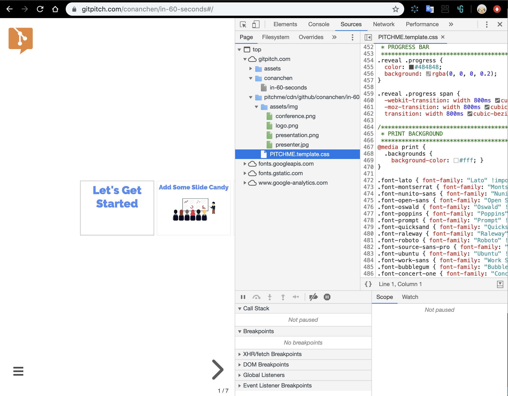

# 商品服务规格规范编辑发布功能模块

## Features

### 编辑
1. 商家用markdown编辑slide、配音视频、编辑音视频讲解slide内容，支持预览编辑（根据比例预览一个或多个幻灯片）
1. 配音过程中，语音可被翻译成文字脚本，可修改文字脚本
1. markdown示例当作一个tab一直打开以便随时参考语法，左边编辑右边预览如vscode

### 播放
1. 客户按自己节奏学习观看slide（自动播放、暂停slide等）
1. 一张slide上的内容可以分时分段显示（如商家的配音讲完一节再显示下一节）

### 交互
1. 客户通过IM进行文本、语音、视频讨论提问，提问实时推送给商家，了解商家、客户在线状态等
1. 商家客户可以操作播放slide并同步在彼此的终端（windows、mac、android、ios、ipad）
1. 搜索历史聊天记录，就像slack上的

### 进阶
1. 根据知识图谱展示slide内相关知识
1. 商家编辑Quiz、客户答题小考
1. （商家、客户）也可作为（作者、读者）、（讲师、学生）

## Reference
- [Slide Decks for Developers GitPitch is a Modern PowerPoint Powered by Markdown & Git Available on OSX, Linux, and Windows 10](https://gitpitch.com/)
- [Flipped Classroom Video Software](https://www.panopto.com/panopto-for-education/flipped-classroom/)
- [Reveal.js：把你的 Markdown 文稿变成 PPT](https://sspai.com/post/40657)
- [Presentation libraries such as Reveal.js or services such as GitPitch can publish dynamic slideshows from modular markdown components.](https://gitpitch.com/)
- 
- [Make better presentations Slides is a place for creating, presenting and sharing slide decks.](https://slides.com/)
- [It's a presentation framework based on the power of CSS3 transforms and transitions in modern browsers](https://github.com/impress/impress.js/)
- [DevOps for Presentations: Reveal.js, Markdown, Pandoc, GitLab CI](https://medium.com/isovera/devops-for-presentations-reveal-js-markdown-pandoc-gitlab-ci-34d07d2c1011)
- [Beautiful presentations from markdown — who knew it could be so easy?](https://medium.com/@mandieq/beautiful-presentations-from-markdown-who-knew-it-could-be-so-easy-d279aa7f787a)
- [reveal.js on steroids! Get beautiful reveal.js presentations from any Markdown file](https://github.com/webpro/reveal-md)
- [How to create data-driven presentations with jupyter notebooks, reveal.js, host on github, and show it to the world](https://towardsdatascience.com/how-to-create-data-driven-presentations-with-jupyter-notebooks-reveal-js-e7a42a1fb7d7)
- [Creating Reveal.js slides with R Markdown](http://www.jenniferbradham.org/post/reveal_js_markdown/)
- [TimelineJS is an open-source tool that enables anyone to build visually rich, interactive timelines. ](https://timeline.knightlab.com/)