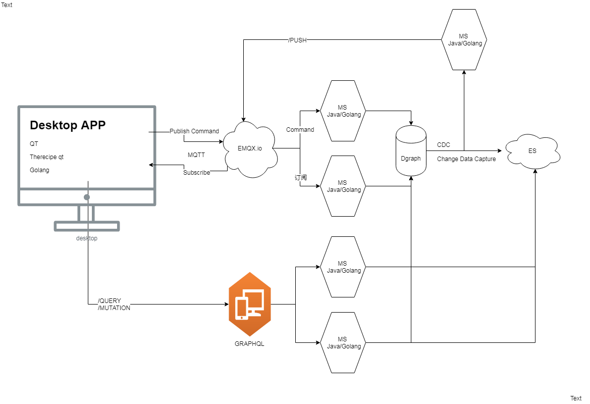

# Biz table data for any team FMSOP Dapp v1


## 技术栈

The choice of Golang comes from the fact that it has the same tooling on every platform. Plus Golang is a great language because it keeps everything simple and readable, which makes it easy to build cross-platform plugins.

**[Wails applications consist of 2 parts: 1️⃣ A backend written in Go 2️⃣ A frontend written using standard HTML/JS/CSS](https://wails.app/quick_start.html)**
- [用户界面：Building a Desktop App in Go using Wails](https://medium.com/js-dojo/building-a-desktop-app-in-go-using-wails-b7f5825f986a)
- [用户界面：Build a Vue chat app](https://medium.com/js-dojo/build-a-vue-chat-app-1822e7d70a5e)
- [用户界面：](https://madewithvuejs.com/clipdio?ref=vuetifyjs.com)
- [用户界面：Package systray is a cross platfrom Go library to place an icon and menu in the notification area. Tested on Windows 8, Mac OSX, Ubuntu 14.10 and Debian 7.6.](https://github.com/getlantern/systray)

- [消息获取：A GraphQL client library for Go](https://blog.machinebox.io/a-graphql-client-library-for-go-5bffd0455878)
- [消息推送：](http://emqtt.io/)

- [监控剪贴板：This Go application will monitor your clipboard for urls and automatically starts download with youtube-dl.](https://github.com/hebestreit/clipboard-yt-dl)
- [监控剪贴板：clipboard.ReadAll()](https://github.com/atotto/clipboard/blob/master/clipboard_windows.go)
- [监控剪贴板：Monitor starts monitoring the clipboard for changes. When a change is detected, it is sent over the channel.](https://github.com/spy16/clipboard/blob/master/cmd/monitor/main.go)
- [监控剪贴板：WriteAll is broken on windows #212, clipb, _ := robotgo.ReadAll()](https://github.com/go-vgo/robotgo/issues/212)
- [Golang 跨平台自动化系统, binding 其他编程语言; 控制键盘鼠标位图和读取屏幕，窗口句柄以及全局事件监听](https://cloud.tencent.com/developer/article/1422348)
- [Golang Slice fancy functions like pop, push, shift etc.](https://github.com/golang/go/wiki/SliceTricks)
- [获取浏览地址：Go lang check if active window the window yo are looking for](https://gist.github.com/obonyojimmy/f80a41b4adb18fe5389e98b64b27f21d)
- [获取浏览地址：how to get URL form any web browser (like firefox,ie,google chrome,...) in C#](https://www.codeproject.com/Questions/354848/how-to-get-URL-form-any-web-browser-like-firefox-i)
- [获取浏览地址：Golang Desktop Automation. Control the mouse, keyboard, bitmap, read the screen, Window Handle and global event listener.](https://github.com/go-vgo/robotgo)
- [获取输入字符：The hook itself is asynchronous, you can consider calling the hook code. ](https://github.com/go-vgo/robotgo/issues/214)
- [C#--知道了某个浏览器窗口的句柄，可以获取到里面的 HTML 吗？](https://www.v2ex.com/t/596698)
- [如何获取Windows中活动的Google Chrome标签的网址？](https://oomake.com/question/3200238)
- [Qml全局按键](https://blog.csdn.net/zhengtianzuo06/article/details/78414871)


- [三方登录：Easy social login in Go lang](https://codelike.pro/easy-social-login-oauth-in-go-lang/)
- [三方登录：Choose a subpackage. Register the LoginHandler and CallbackHandler for web logins or the TokenHandler for (mobile) token logins.](https://github.com/dghubble/gologin)
- [本方登录：Vue.js + Vuex - JWT Authentication Tutorial & Example](https://jasonwatmore.com/post/2018/07/06/vue-vuex-jwt-authentication-tutorial-example)
- [本方登录：We are intercepting axios call to determine if we get 401 Unauthorized response. If we do, we dispatch the logout action and the user gets logged out of the application. This takes them to the login page like we designed earlier and they can log in again.](https://scotch.io/tutorials/handling-authentication-in-vue-using-vuex)

## 功能
- 系统托盘
- 用户登录注册（手机、电邮、微信、QQ、Github）,
- 忘记密码（通过电邮、手机短信重置密码）
- 接收消息推送通知
- 刷新消息列表
- 根据剪贴板中信息智能刷新助手信息（可能是工作指南、知识网页、某个网页应用的链接...）


# FMOP Manager Dapp v1


## 技术栈
- [用户界面：Qt与HTML/JavaScript网页端通信和调用 new QWebChannel(socket, function(channel)](https://github.com/therecipe/qt/blob/5355937d17e9eee62460706cb9a033180014400e/internal/examples/webchannel/webview/index.html)
- [用户界面：Qt binding for Go (Golang) with support for Windows / macOS / Linux / FreeBSD / Android / iOS / Sailfish OS / Raspberry Pi / AsteroidOS / Ubuntu Touch / JavaScript / WebAssembly](https://github.com/therecipe/qt/wiki/Gallery)

- [用户界面：State of GUI App Development with Go in 2018: When possible, use therecipe/qt + QtQuick. Except for the license, I don’t think there are any reason to not use it. This is what I ended up using for the company’s app. If you have no time, chased by deadline, and don’t have any time to test other tools, use Electron. However, do note that Electron is really heavy on resources, so I’m only using this as the last or temporary choice. For the company’s app, I’ve used Electron for the first three months, then I replace it with Qt. Sciter is interesting because it’s faster and lighter than the other, not to mention it has permissive license unlike Qt and therecipe/qt. However, because I was busy and the docs are not really good, I haven’t use it very much and only tested the demos. If you’ve got the time to learn, experiment, digging information and asking in forum, you should try it. I can’t recommend webview because sometimes it’s failed to render my view correctly.](https://www.douban.com/note/690095809/)
- [用户界面：When possible, use therecipe/qt + QtQuick. Qt Quick简介](https://wizardforcel.gitbooks.io/qt-beginning/content/61.html)

- [用户界面：QML is an acronym that stands for Qt Meta-object Language. It is a declarative programming language that is part of the Qt framework. QML's main purpose is fast and easy creation of user interfaces for desktop, mobile and embedded systems. QML allows seamless integration of JavaScript, either directly in the QML code or by including JavaScript files.](https://riptutorial.com/qml)

- [用户界面：Why you should use Qt/QML for your next cross-platform application — part 1 — desktop](https://medium.com/&commat;petar.koretic/why-you-should-use-qt-qml-for-you-next-cross-platform-application-part-1-desktop-5e6d8856b7b4)
- [用户界面：A Book about Qt5, Model-View-Delegate](http://qmlbook.github.io/ch07-modelview/modelview.html)
- [用户界面：Qt5的安装,选择therecipe/qt的理由是首先因为它提供的API与原生Qt以及其他binding（例如pyqt5）几乎一样](https://www.cnblogs.com/apocelipes/p/9300335.html)
- [用户界面：如何编译使用了therecipe/qt的项目](https://www.cnblogs.com/apocelipes/p/9300335.html)
- [用户界面：开发方式采用该作者的建议，Got-qt GUI Framework 一个利用Go和QML中构建跨平台GUI界面的框架,This is a framework to make desktop/mobile applications in Go with a GUI written in Qt Qml. It uses the Material framework from Google for the UI in Qml, and uses Go as a backend.  I just wanted an easy way to build desktop apps with Go.](https://github.com/amlwwalker/got-qt)
- [用户界面:This is part 5 of a series of demo apps helping you to understand Qt 5.7 for x-platform development on Android and iOS. For Tablets and Desktop Google recommends to use a SideBar – so I implented a SideBar which will be shown automagically in Landscape.](https://appbus.wordpress.com/2016/06/14/bottom-navigation-app/)
- [用户界面：在QML中使用QSystemTrayIcon(系统托盘)](https://blog.csdn.net/u011283226/article/details/79812221)
- [A curated list of awesome Qt and QML libraries, resources, projects, and shiny things.](https://github.com/mikalv/awesome-qt-qml)
- [ModelView with QTreeView and QFileSystemModel](https://www.bogotobogo.com/Qt/Qt5_QTreeView_QFileSystemModel_ModelView_MVC.php)
- [没有可以使用TreeView的本机QML模型，所以我实现了一个试图通用的模型](https://github.com/eyllanesc/stackoverflow/tree/master/questions/56264007)
- [一套酷炫的QtQuick/Qml基础库和示例](https://github.com/jaredtao/TaoQuick)
- [qml TableView 表格编辑器](https://github.com/jaredtao/TableEdit)
- [Qml组件化编程](https://jaredtao.github.io/)
- [Best_Practices_in_Qt_Quick](http://cdn2.hubspot.net/hubfs/149513/Roadshow_US/Best_Practices_in_Qt_Quick.pdf)

- [通过WebChannel/WebSockets与QML中的HTML交互](https://www.cnblogs.com/suRimn/p/10238720.html)
- [基于 QWebChannel 的前端通信方案:本文将结合自身在开发中的一些经历，将从前端的角度探讨 QWebChannel 在 client 端实例化的本质，以及如何将 QWebChannel 集成到 Vue.js 等类似前端框架中。](https://juejin.im/post/5d46b1966fb9a06afe127b15)
- [最清晰Qt与JS通过qwebchannel交互例子](https://blog.csdn.net/sunnyloves/article/details/88683090)
- [很有意思就是我想要的：Qt的QWebChannel和JS、HTML通信/交互驱动百度地图](https://blog.csdn.net/u014281970/article/details/82110446)
- [使用 Qt WebChannel 实现 C++/QML 和 HTML 页面之间交互: 注：本文中提到的客户端和服务端其实是在同一个应用程序内，因为 WebChannel 是基于 WebSocket 实现的，所以会有这种客户端和服务端的叫法。](https://www.pressc.cn/1085.html)
- [Best Practices in Qt Quick/QML - Part I](https://www.slideshare.net/ICSinc/best-practices-in-qt-quick-qml-part-1)
- [10 Keys to Ensuring Success for Your Next Qt Project](https://www.slideshare.net/ICSinc/10-keys-to-ensuring-success-for-your-next-qt-project)
- 

### Desktop APP 
- 
    - [Data Layer(Local Data Storage): Embedded database in go for desktop: BadgerHold is an embeddable NoSQL store for querying Go types built on Badger](https://github.com/timshannon/badgerhold)
    - [Communication Layer(TCP): 58到家通用实时消息平台架构细节（Qcon2016）](https://mp.weixin.qq.com/s?__biz=MjM5ODYxMDA5OQ==&mid=2651959410&idx=1&sn=b91b5721ca394d15fb391097eddb752d&scene=21)
    - [Communication Layer(TCP): The Leader in Open Source IoT Messaging Scalable and Reliable Real-time MQTT Messaging Engine for IoT in 5G Era](https://www.emqx.io/)
    - [Communication Layer(TCP): Guidance on using emqttd for a chat app](https://github.com/emqx/emqx/issues/634)

## RPA


- [Robotics Process Automation(RPA) allows organizations to automate task just like a human being was doing them across application and systems. Robotic automation interacts with the existing IT architecture with no complex system integration required. RPA can be used to automate workflow, infrastructure, back office process which are labor intensive. These software bots can interact with an in-house application, website, user portal, etc. The RPA is a software program which runs on an end user's pc, laptop or mobile device. It is a sequence of commands which are executed by Bots under some defined set of business rules.](https://www.guru99.com/robotic-process-automation-tutorial.html)


## Golang+QtQuick QML Win7开发环境搭建

- 打开PowerShell

```bash
    PS E:\conan> go version

    go version go1.13 windows/amd64

    PS E:\conan> dir env:

    GO111MODULE                    on
    GOPATH                         e:\conan\go
    GOPROXY                        https://goproxy.io
    GOROOT                         D:\tools\Go\
    QT_DIR                         D:\tools\Qt
    QT_VERSION                     5.13.1
    PATH                           D:\tools\go\bin;E:\conan\go\bin;


```

[therecipe/qt Installation on Windows](https://github.com/therecipe/qt/wiki/Installation-on-Windows)
    
```
    In Module mode

    PS E:\conan> git clone https://github.com/therecipe/examples.git ; cd ./examples ; go mod download ; go get -u -v github.com/therecipe/qt/cmd/qtdeploy ; go get -u -v github.com/therecipe/qt/cmd/... ; go mod vendor ; git clone https://github.com/therecipe/env_windows_amd64_513.git vendor/github.com/therecipe/env_windows_amd64_513 ; $env:GOPATH\bin\qtdeploy test desktop ./basic/widgets
```
    
- 打开cmd
```
    d:\git\examples>where qtdeploy
    E:\conan\go\bin\qtdeploy.exe
```    

[demo setup got qt (use subtitles)](https://www.youtube.com/watch?v=T96KOy4sTJ8&feature=youtu.be)

## Golang+QtQuick QML Macos 开发环境搭建

```bash
    
    ConandeMacBook-Pro:examples conanchen$ go version
    go version go1.13 darwin/amd64

    ConandeMacBook-Pro:examples conanchen$ env |grep GO
    GO111MODULE=on
    GOPROXY=https://goproxy.io
    GOROOT=/usr/local/Cellar/go/1.13/libexec
    GOPATH=/Users/conanchen/go
    ConandeMacBook-Pro:examples conanchen$ env |grep QT
    QT_HOMEBREW=true
    QT_DIR=/usr/local/opt/qt    
```

**暂时只试通 GOPATH模式**

```bash
  $  export GO111MODULE=off
  $  curl www.google.com
  $  export http_proxy=127.0.0.1:1087
  $  export https_proxy=127.0.0.1:1087
  $ go get -u -v github.com/therecipe/qt/cmd/... && $(go env GOPATH)/bin/qtsetup test && $(go env GOPATH)/bin/qtsetup -test=false

  $ cd /Users/conanchen/go/src/github.com/therecipe/qt/internal/examples
  $ qtdeploy test desktop showcases/wallet

  $ git clone https://github.com/therecipe/examples.git
  $ cd examples; pwd
    /Users/conanchen/git/therecipe/examples
  $ qtdeploy test desktop ./basic/widgets
  $ go run ./basic/widgets/main.go  (编译好后同样可以直接用go run 运行)

```


**In Module mode**
    
```
    xcode-select --install; git clone https://github.com/therecipe/examples.git && cd ./examples && go mod download && go get -u -v github.com/therecipe/qt/cmd/qtdeploy && go get -u -v github.com/therecipe/qt/cmd/... && go mod vendor && git clone https://github.com/therecipe/env_darwin_amd64_513.git vendor/github.com/therecipe/env_darwin_amd64_513 && $(go env GOPATH)/bin/qtdeploy test desktop ./basic/widgets

```

还不能把自己的工程设为go module工程，否则 qtdeploy test desktop ./basic/quick 失败

```
    ConandeMacBook-Pro:quick conanchen$ go mod init github.com/firstfamily/quick
    go: creating new go.mod: module github.com/firstfamily/quick
    ConandeMacBook-Pro:quick conanchen$ go get ./...
    go: finding github.com/therecipe/qt latest
    # github.com/therecipe/qt/quickcontrols2
    quickcontrols2.cpp:9:10: fatal error: 'QByteArray' file not found
    # github.com/therecipe/qt/core
    core.cpp:10:3: error: ------------------------------------------------------------------
    core.cpp:11:3: error: please run: '$(go env GOPATH)/bin/qtsetup'
    core.cpp:12:3: error: more info here: https://github.com/therecipe/qt/wiki/Installation
    core.cpp:13:3: error: ------------------------------------------------------------------
    core.cpp:15:10: fatal error: 'QAbstractAnimation' file not found
    ConandeMacBook-Pro:quick conanchen$ pwd
    /Users/conanchen/git/therecipe/examples/basic/quick
    ConandeMacBook-Pro:quick conanchen$ cd ../..
    ConandeMacBook-Pro:examples conanchen$ qtdeploy  test desktop ./basic/quick
    WARN[0003] parser.LoadModule                             error=EOF module=Qml
    WARN[0003] parser.LoadModule                             error=EOF module=Core
    WARN[0003] parser.LoadModule                             error=EOF module=Widgets
    WARN[0003] parser.LoadModule                             error=EOF module=Gui
    WARN[0003] parser.LoadModule                             error=EOF module=QuickControls2
    WARN[0003] parser.LoadModule                             error=EOF module=Quick
    WARN[0003] parser.LoadModule                             error=EOF module=Network
    ERRO[0005] failed to run command                         _func=RunCmd cmd="bash -c /usr/local/bin/go build -p 4 -v -trimpath -o /Users/conanchen/git/therecipe/examples/basic/quick/deploy/darwin/quick.app/Contents/MacOS/quick -tags=minimal -ldflags=all=\"-w\"" dir=/Users/conanchen/git/therecipe/examples/basic/quick env="GOFLAGS=-mod=vendor TERM=xterm-256color GOARCH=amd64 SHELL=/bin/bash LC_CTYPE=zh_CN.UTF-8 QT_DIR=/usr/local/opt/qt GOROOT=/usr/local/Cellar/go/1.13/libexec LDFLAGS=-L/usr/local/opt/qt/lib FLUTTER_STORAGE_BASE_URL=https://storage.flutter-io.cn XPC_FLAGS=0x0 OSTYPE=darwin HTTP_PROXY=127.0.0.1:1087 LOGNAME=conanchen CGO_ENABLED=1 CPPFLAGS=-I/usr/local/opt/qt/include __CF_USER_TEXT_ENCODING=0x1F5:0x19:0x34 QT_HOMEBREW=true PWD=/Users/conanchen/git/therecipe/examples PATH=/usr/local/opt/qt/bin:/Users/conanchen/go/bin:/Users/conanchen/Library/flutter/bin:/usr/local/bin:/usr/bin:/bin:/usr/sbin:/sbin:/usr/local/Cellar/go/1.13/libexec/bin:/Users/conanchen/go/bin XPC_SERVICE_NAME=0 SHLVL=1 _=/Users/conanchen/go/bin/qtdeploy OLDPWD=/Users/conanchen/git/therecipe/examples/basic/quick PUB_HOSTED_URL=https://pub.flutter-io.cn HOME=/Users/conanchen USER=conanchen SSH_AUTH_SOCK=/private/tmp/com.apple.launchd.CbslYBimHQ/Listeners GOPATH=/Users/conanchen/go TMPDIR=/var/folders/td/0ny4r8md2vg9lz2t2knwr7yr0000gn/T/ Apple_PubSub_Socket_Render=/private/tmp/com.apple.launchd.RMOJ9UYPA6/Render GO111MODULE=on HTTPS_PROXY=127.0.0.1:1087 GOOS=darwin" error="exit status 2" name="build for darwin on darwin"
    github.com/firstfamily/quick
    # github.com/firstfamily/quick
    ./main.go:17:2: undefined: core.QCoreApplication_SetAttribute
    ./main.go:17:37: undefined: core.Qt__AA_EnableHighDpiScaling
    ./main.go:20:2: undefined: widgets.NewQApplication
    ./main.go:25:2: undefined: quickcontrols2.QQuickStyle_SetStyle
    ./main.go:31:10: undefined: quick.NewQQuickView
    ./main.go:32:22: undefined: core.NewQSize2
    ./main.go:33:21: undefined: quick.QQuickView__SizeRootObjectToView
    ./main.go:40:17: undefined: core.QUrl_FromLocalFile
    ./main.go:48:2: undefined: widgets.QApplication_Exec

    ConandeMacBook-Pro:examples conanchen$ rm basic/quick/go.mod 
    ConandeMacBook-Pro:examples conanchen$ qtdeploy  test desktop ./basic/quick
    ConandeMacBook-Pro:examples conanchen$ 

```


# Win7 下用Golang开发GUI程序（01）安装Golang、QT并设置相关变量

- [用Golang开发GUI程序（01）安装Golang、QT并设置相关变量](https://www.yumenaka.net/2019/04/23/golang_gui_qt_01/)
- [MSYS2 + MinGW-w64 + Git + gVim 环境配置](http://dantvt.is-programmer.com/posts/63161.html)

## msys2 [去官网下载安装包，一路下一步即可](https://www.msys2.org/)

```shell
    我把安装路径改成了“ D:\msys64 ”
```

**启动 MSYS2 MinGW 64-bit**

>   

```shell
    最好设置梯子代理
    # export http_proxy=127.0.0.1:1087
    # export https_proxy=127.0.0.1:1087

    安装QT相关包
    # pacman -Syyu
    # pacman -S gcc git mingw-w64-x86_64-go （安装golang）
    # pacman -S mingw-w64-x86_64-qt-creator mingw-w64-x86_64-qt5
    # pacman -S mingw-w64-x86_64-qt-creator mingw-w64-x86_64-qt5-static
    # pacman -Scc  (清除安装包，最好不要)

```

## 设置环境变量
```shell
    设置
    # export QT_DIR=/d/msys64/mingw64/qt5-static
    # export QT_MSYS2_DIR=/d/msys64
    # export QT_MSYS2_ARCH=amd64
    # export QT_WEBKIT=true
    # export QT_MSYS2_STATIC=true
    # export GOPATH=/e/conan/go
    # export GOPROXY=https://goproxy.io
    # export GOROOT=/mingw64/lib/go

    # export PATH=$PATH:$GOROOT/bin
    # export PATH=$PATH:$GOPATH/bin

    最好设置梯子代理
    # export http_proxy=127.0.0.1:1087
    # export https_proxy=127.0.0.1:1087


```


## 安装therecipe/qt
```bash

    # go get -v github.com/therecipe/qt/cmd/...
    # qtsetup


```